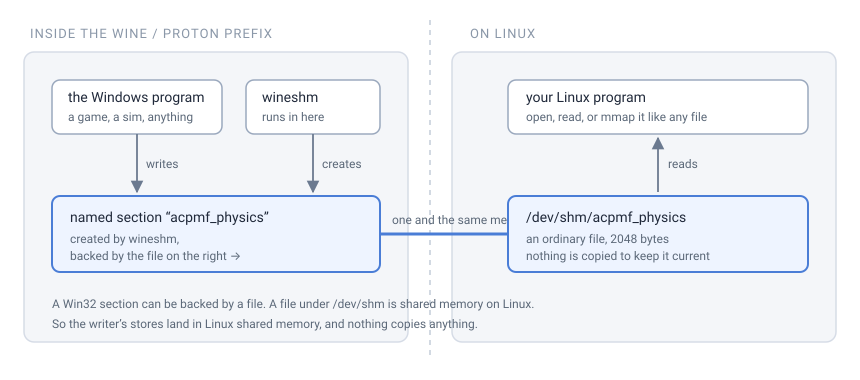
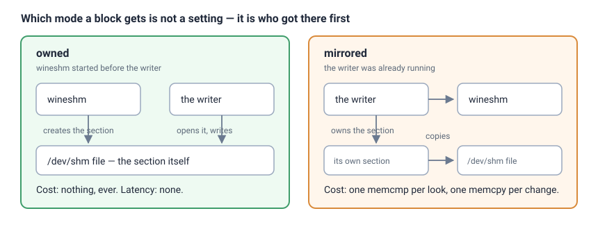
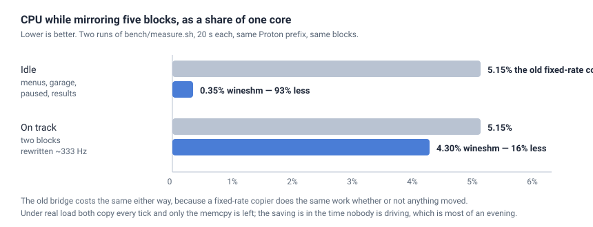
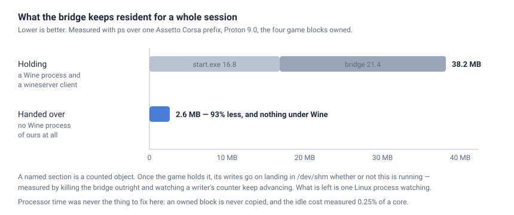

# wineshm

Expose a Windows program's named shared memory to Linux, from inside a Wine or
Proton prefix.

A Windows program under Proton can publish a block of shared memory — telemetry
from a racing game, a state block, a score — and nothing on the Linux side can
open it. The name lives in the prefix's own kernel object namespace, and that
namespace stops at the prefix.

`wineshm` bridges it. Run it **inside** the prefix, say which blocks you want,
and each one appears as an ordinary file under `/dev/shm` that any Linux
program can open, map and read.

```
wineshm.exe --preset assetto-corsa
```

```
$ ls -l /dev/shm/acpmf_physics
-rw-r--r-- 1 you you 2048 /dev/shm/acpmf_physics
```

MIT licensed. One dependency, Windows-only. No runtime, no service, no daemon.

| | |
|---|---|
| **Works with** | any Windows program under Wine or Proton that publishes named shared memory |
| **Ready-made** | Assetto Corsa, Assetto Corsa Competizione, rFactor 2 — or name your own blocks |
| **Finds Steam on** | native, Flatpak, Snap, Steam Deck, Bazzite, and libraries on other disks |
| **Needs installing** | nothing. Not protontricks, not a runtime, not a service |
| **Costs when idle** | 0.35% of one core against 5.15% for a fixed-rate copier ([measured](#measured)) |
| **Binary** | 332 KB |
| **Tests** | 149, and the benchmark is a script in the repository |

---

## Installing

On Arch, a built package is attached to every release:

```bash
sudo pacman -U https://github.com/Rgosh/wineshm/releases/latest/download/wineshm-0.6.1-1-x86_64.pkg.tar.zst
```

Or build it from the `PKGBUILD` in this repository, which is what `yay -B`
does for a local directory:

```bash
git clone https://github.com/Rgosh/wineshm && cd wineshm/packaging/aur && makepkg -si
```

Either way `wineshm` goes on your PATH and the Windows half in
`/usr/lib/wineshm/wineshm.exe`, where the program looks for it by itself —
there is nothing to configure and nothing to copy into a game folder.

> The package is not on the AUR yet. Account registration there is closed
> while they deal with a wave of automated sign-ups; the `PKGBUILD` is ready
> for the day it reopens.

Anywhere else, or to build it yourself, see [Building](#building).

## How it works

A Win32 section can be backed by a **file**, and a file under `/dev/shm` *is*
shared memory on the Linux side. Create the section under the name the Windows
program expects, backed by that file, and the writer's stores land in Linux
shared memory with nothing copying anything.



## The two modes

Which one a block gets is not a setting. It is decided by who got there first,
and the program prints it per page.



| | **owned** | **mirrored** |
|---|---|---|
| When | `wineshm` started before the writer | the writer was already running |
| Cost while running | nothing, ever | one comparison per look, one copy per change |
| Latency | none — it is the same memory | up to one interval |
| Why | `CreateFileMappingW` made the section, backed by the file | the name was taken, so it is opened and copied |

`CreateFileMappingW` with a name that is **already taken** quietly hands back
the existing section and ignores the file it was given. A bridge that does not
notice creates nothing, publishes a file frozen at whatever was in it, and
looks like it is working. Mirroring is what makes the start-up order stop
mattering — which is the thing people actually trip over.

## Quick start

Build it for Windows, and run it in the prefix:

```bash
rustup target add x86_64-pc-windows-gnu
cargo build --release --target x86_64-pc-windows-gnu
```

Then, inside the prefix — see [Starting it](#starting-it-in-a-prefix) if that
part is the problem:

```bash
wineshm.exe --preset assetto-corsa
```

Read it from Linux like any other file:

```rust
let mut file = std::fs::File::open("/dev/shm/acpmf_physics")?;
let mut bytes = [0u8; 2048];
file.read_exact(&mut bytes)?;
```

### Your own blocks

```bash
wineshm.exe --page MySharedThing:4096 --page OtherThing:1M
```

| Flag | What it does |
|---|---|
| `--preset NAME` | A ready-made list. `assetto-corsa`, `rfactor2` |
| `--page NAME:SIZE` | One block. Repeatable. Size takes `K` or `M` |
| `--dir PATH` | Where to publish. Default `/dev/shm` |
| `--quick MS` | Pace while a mirrored page is changing. Default 4 |
| `--slowest MS` | Slowest pace for a page that has gone quiet. Default 64 |
| `--heartbeat NAME` | The block that changes while the writer is alive |
| `--blank-after MS` | How long it may be quiet before everything is zeroed. Default 5000 |
| `--pages-from FILE` | A file describing a program. Repeatable |
| `--probe NAME` | Measure a section the program has already made |
| `--watch` | Show, live, which blocks are actually changing |
| `--handoff` | Leave once the game holds the section. Needs `--appid` |
| `--verify` | Report what is published here already, then stop |
| `--json` | With `--verify`, report as JSON instead of a table |
| `--quiet` | Say nothing but errors |

`--verify` runs on **Linux** as happily as under Wine, because the note it
reads is an ordinary file:

```
$ wineshm --verify
wineshm 0.1.0 is publishing, pid 360
  PAGE                                  BYTES  MODE      ON DISK
  acpmf_physics                          2048  owned     2048 bytes
  acpmf_graphics                         2048  mirrored  2048 bytes
```

### A program this has no preset for

There are two presets and there are a great many programs. Adding one does not
need a fork, and — more importantly — does not need you to guess.

**The name is usually documented. The size usually is not**, and getting it
wrong fails in the direction nobody notices: ask for less than the block holds
and it maps, everything looks fine, and every field past your size is simply
absent. Asking for too much at least fails loudly.

So measure it. Start the program, then, inside the same prefix:

```bash
wineshm.exe --probe MySharedThing
```

```
  SECTION                               SIZE
  MySharedThing                         more than 12288 and at most 16384 bytes
  NotRunningYet                         not there — is the program running?
```

The answer is a range on purpose. Windows reports mapped memory in whole 4 KiB
pages, so a 2048-byte block and a 4096-byte one are indistinguishable from
outside, and a single number would look like a measurement it is not. Use it to
check that the size you have is in the right range at all — being an order of
magnitude out is the mistake that costs an evening.

Then write it down, so you never type it again and so you can give it to
somebody else:

```
# my-program.txt
MySharedThing:16384
OtherThing:2048

heartbeat MySharedThing
```

```bash
wineshm.exe --pages-from my-program.txt
```

`#` starts a comment, blank lines are ignored, and `heartbeat NAME` names the
block that changes while the program is alive — see [When the writer
closes](#when-the-writer-closes). Every complaint carries the file and the
line number, because a file is a thing somebody edits.

`recipes/` has Assetto Corsa written out as a worked example and a template
with the whole procedure in its comments.

## Is anything actually moving?

When telemetry is wrong, the candidates all look alike: the program is not
writing, the bridge is not copying, the reader has the wrong block, or the
numbers are fine and the reader's arithmetic is not. `--watch` separates the
first two from the rest.

```bash
wineshm --watch
```

```
watching 4 blocks in /dev/shm — Ctrl-C to stop
  acpmf_physics                     moving   98% of looks
  acpmf_graphics                    moving   61% of looks
  acpmf_static                      still    last changed 84s ago
  acpmf_crewchief                   never    nothing has ever written to it
```

It runs on **Linux**, outside the prefix, while the game is running — the
blocks are ordinary files, so watching needs no Win32 and no prefix, and it can
sit in a terminal beside the game.

Three states rather than a number, because **"never written to" and "stopped
being written to" are different faults** — a wrong name or a program that has
not started, against a session that has ended — and in a percentage they look
identical.

The measure is the proportion of looks that found a change, not a rate. A
333 Hz block cannot be counted by sampling without sampling faster than it is
written, and this looks fifty times a second precisely so that watching costs
nothing.

## Starting it in a prefix

The usual instruction is `protontricks-launch`, and on an immutable
distribution — Bazzite, Silverblue, SteamOS — that is a dependency you may not
be able to install. Worse, it is usually available only as a **Flatpak**, and a
Flatpak has a `/dev/shm` of its own: the bridge inside one publishes into a
tmpfs that exists only in that sandbox, reports success, and nothing outside
can see a byte of it.

Nothing needs to be installed. Steam already ships the Proton the game is set
to use, and records which one in the prefix it built:

```bash
PFX="$HOME/.local/share/Steam/steamapps/compatdata/244210"
PROTON="$(sed -n 2p "$PFX/config_info" | sed 's|/share/fonts/$||')"
WINEPREFIX="$PFX/pfx" "$PROTON/bin/wine" ./wineshm.exe --preset assetto-corsa
```

The `launch` module does exactly this, so a program shipping `wineshm`
alongside itself does not have to shell out to anything:

```rust
let how = wineshm::launch::how_to_launch(244210);
let (program, args) = how.command(Path::new("./wineshm.exe"));
```

Two things that will bite if you write the command by hand: keep the `./`
before the executable, and do not run it from `/tmp` — that path is not mapped
in a Proton prefix, and Wine answers "file not found" with the file plainly
there.

### Where it looks

| Layout | Path |
|---|---|
| Native | `~/.steam/steam`, `~/.local/share/Steam` |
| Flatpak | `~/.var/app/com.valvesoftware.Steam/.local/share/Steam` |
| Flatpak, older | `~/.var/app/com.valvesoftware.Steam/data/Steam` |
| Snap | `~/snap/steam/common/.local/share/Steam` |
| Extra libraries | every `path` in `steamapps/libraryfolders.vdf` |

The Steam Deck and Bazzite use the native layout, so they are not special
cases. A library on an SD card or a second disk is found through
`libraryfolders.vdf`, which is why the Deck works without being named.

## Why it is cheaper than copying on a timer

The obvious way to mirror is a fixed interval: wake up every few milliseconds,
copy every page, sleep. That is what the bridge this was written to replace
does, and most of it is spent on nothing — a racing game rewrites its physics
block three hundred times a second *while the car is moving* and not at all in
the menus, in the garage, on a loading screen or while the session is paused.
Two of Assetto Corsa's four blocks are written once a session and never again.

So `wineshm`:

1. **Compares before copying.** A `memcmp` reads memory and writes none, and
   stops at the first byte that differs. Most looks find nothing and stop
   there.
2. **Backs off when a page is quiet**, doubling from 4 ms up to 64 ms, and
   snaps back to 4 ms the instant anything moves. Per page, so a static block
   does not keep a physics block's pace.
3. **Publishes with a `memcpy`, not a syscall.** The destination is its own
   file mapped into the process, so a change is a store to memory the kernel
   writes back — where a fixed-rate copier does a `seek` and a `write` per page
   per tick.

### Measured

Both bridges mirroring the same five Assetto Corsa blocks in the same Proton
prefix, CPU time taken from `/proc/<pid>/stat`. `bench/measure.sh` is the
script; the numbers below are from one run of it and will move a little on
other hardware.



| Mirroring 5 blocks | old `shm-bridge` | `wineshm` | |
|---|---|---|---|
| **Idle** — menus, garage, paused, results | 5.15% of a core | **0.35%** | 93% less |
| **Busy** — two blocks at ~333 Hz | 5.15% of a core | **4.30%** | 16% less |
| Binary on disk | 942,132 bytes | **332,288 bytes** | 65% smaller |

Two runs, twenty seconds each, same prefix, same five blocks, Proton
Experimental. The idle and busy figures for the old bridge are identical
because a fixed-rate copier does the same work either way — which is the whole
point.

The program will also tell you its own numbers when it stops:

```
  MIRRORED PAGE                       LOOKS   COPIES    WORK  PACE
  acpmf_physics                         311        0    0.0%  every 64 ms
  acpmf_static                          311        0    0.0%  every 64 ms
  0 copies in 622 looks — 0.0% of them did any work, 1244 KiB not copied
```


The honest summary: when a page is genuinely changing every few milliseconds,
the comparison and the backoff earn nothing and the win narrows to the copy
itself. **The saving is in the time nobody is driving** — which, over an
evening, is most of it.

## When the writer closes

**The blocks outlive the program that filled them.** A game exits; the section
it was writing into stays, because this bridge is holding it; and the file goes
on holding the last frame for ever. A reader opening it finds a car at some
speed on some circuit — real numbers, from a session that ended. Start the game
again and, for the moment before its first frame lands, that old frame is still
what anybody reads.

Name the block that changes while the writer is alive, and when it goes quiet
everything is zeroed:

```bash
wineshm.exe --preset assetto-corsa
```

A preset knows which of its own blocks moves, and switches this on itself —
`--heartbeat` is only for naming one by hand. That matters because the wrong
choice is silent: Assetto Corsa's `acpmf_static` carries the car and the track
and is written once a session, so naming *it* would blank a session that is
still running.

```
nothing has written to acpmf_physics for 5s — every block zeroed, so what is
left of the last session does not read as this one
```

Zeroes are the honest answer: they are the state every reader already waits
through, and the state a block is in before anybody writes to it.

You name the block because you are the one who knows which of them moves —
this crate does not know what any program's blocks mean, and guessing would
blank a static block that is simply constant for the session. Nothing is
blanked unless you ask.

It blanks **once** per silence rather than on every look, and the writer coming
back is noticed on its first frame, so a game restarted needs nothing done to
it.

### When the bridge itself is killed

The watchdog above covers the *writer* going away while the bridge is still
running. It has nothing left to notice with when the bridge is the one that
went — the window closed, the machine logged off, a script reaped it — and the
files would stay behind holding the last frame.

Two things close that, and which is which was measured under Proton rather than
assumed:

| How it is killed | What happens |
|---|---|
| Ctrl-C, window closed, logoff, shutdown | Wine delivers a console control event. The bridge blanks and unlinks before it goes |
| `SIGTERM` | **Wine does not translate it.** The Linux side finishes the job instead |

`SIGTERM` is what a script, a session manager and Steam all send, so when the
bridge was started with `--appid` the Linux half outlives it, waits for the
note's pulse to stop, and takes away the pages it asked for:

```
the bridge inside the prefix did not shut down cleanly — took away 4 pages it
left behind, so what is left of that session does not read as a live one
```

It waits for the pulse because the note of a bridge that has just died is by
definition a moment old — asking "is anything publishing here?" the instant the
process exits always answers yes, about the corpse. A note that goes stale was
its; one that keeps being touched belongs to something alive, and taking its
pages would break a bridge that works.

Neither covers `SIGKILL` or the power going out, and nothing can. That is what
the note's pulse is for, below.

## Nothing running during the session

**A named section in Wine is a counted object.** This program creates one
backed by a file under `/dev/shm`; the game asks for the same name and is
handed the same object. From that moment two processes hold it — and if this
one lets go, the game's handle keeps it alive and the game's writes go on
landing in the file with no bridge in existence.

Measured, then built: the bridge was killed outright and a writer's counter
went on advancing in `/dev/shm`.



```bash
wineshm --appid 244210 --preset assetto-corsa --handoff
```

The copy inside the prefix waits until the game is actually writing, then
leaves. What it costs before and after, measured on one machine with Proton
9.0:

| | holding the section | after handing over |
|---|---|---|
| our Wine processes | `start.exe` 17 MB + bridge 22 MB | **none** |
| our Linux process | — | 2.6 MB |
| **ours in total** | **≈39 MB** | **2.6 MB** |

Processor time was never the problem: an owned page needs no copying, and the
measured idle cost was a quarter of one percent of a core. What went away is a
Wine process and a wineserver client, resident for a whole session for the sake
of a handle nobody needed any more.

### Why it needs somebody watching

The same experiment showed the other half, and it is the reason `--handoff`
needs `--appid` rather than working on its own.

When the game exits it releases the name, and **the file stays**, holding the
last frame for ever. Start the game again and it finds no section of that name,
makes its own — backed by nothing this side can see — and writes into that.
Measured: the second run reported `already existed = false` while the file sat
frozen on the previous session's last frame. A live race beside a file that
looks exactly like live telemetry.

So the Linux half stays behind. It keeps the note's pulse beating, so readers
still see something alive; it watches the block that moves; and when that goes
quiet it blanks the pages, unlinks them, and starts the bridge again so the
next session works like the first.

```
handoff_a is being written to, so the program is holding the section itself —
handing over and leaving
the game is holding the blocks — nothing of the bridge is running now
nothing has written to handoff_a for 3s — the game has gone, so its blocks go too
starting the bridge again, ready for the next session
```

Handing over is refused unless every page is owned, a heartbeat is named, and
that block has actually been written to. A mirrored page is one this program is
copying by hand, so letting go would freeze it; without a heartbeat there would
be nothing left that could notice the game leaving; and bytes changing in a
page this program created and never writes to is the only proof available that
the game has a handle of its own.

## Telling a running bridge from its leftovers

A bridge that exits cleanly takes its pages and its note away. One that is
**killed** — a window closed, a machine suspended, a script that reaped the
wrong process — leaves both behind, and the pages then hold the last bytes
anybody wrote. A reader opening them finds a plausible session that ended
hours ago: every number in it is real, and none of it is now. Nothing looks
wrong, which is what makes it the worst way for this to fail.

So a running bridge rewrites its note every two seconds, and the file's
modified time is a pulse:

```
$ wineshm --verify
wineshm 0.1.0 is publishing, pid 216
  the bridge that published this is gone — the pages are whatever it left
  PAGE                                  BYTES  MODE      ON DISK
  acpmf_physics                          2048  owned     2048 bytes
```

```rust
// Some(note) only while something is actually maintaining it
let live = wineshm::reader::live_publishing(&store);
```

| Call | Answers |
|---|---|
| `publishing` | is there a note, and is it a format I understand |
| `pulse` | is anything still touching it — `Beating`, `Abandoned`, `Ahead` |
| `live_publishing` | both at once, which is what most programs want |

A clock that jumps backwards reports `Ahead` and is treated as alive: calling
a working bridge dead is worse than waiting a moment longer.

The bridge uses the same signal on itself — it refuses to start over a bridge
that is **still beating**, because two of them over one directory means the
second zeroes the files the first is serving and telemetry flickers between
real and blank. A note with no pulse is stepped over rather than obeyed.

## Machine-readable

```bash
$ wineshm --verify --json
{
  "format": 1,
  "version": "0.1.0",
  "pid": 216,
  "alive": false,
  "pulse": "abandoned",
  "pages": [
    { "name": "acpmf_physics", "bytes": 2048, "mode": "owned" }
  ]
}
```

Exit status follows `alive`, so a shell script can use it without parsing
anything.

## Putting it in your own program

Reading a block is opening a file, and the three things that go wrong if you
only do that are the three things `Reader` checks: whether anything is
publishing at all, whether your block is one of them, and whether it is the
size you compiled against. A block of the wrong size is the failure that reads
as data rather than as an error.

```toml
[dependencies]
wineshm = "0.1"
```

```rust
use wineshm::{Page, Store, reader::Reader};

let store = Store::default();
let page = Page { name: "acpmf_physics".into(), bytes: 2048 };

// Is anything there?
if wineshm::reader::publishing(&store).is_none() {
    eprintln!("the bridge is not running");
    return;
}

let reader = Reader::open(&store, &page)?;   // refuses a size mismatch
let mut buffer = [0u8; 2048];
loop {
    reader.read_into(&mut buffer)?;          // positioned read, no cursor
    // …your own parsing…
}
```

`Reader` takes `&self`, so one of them can be shared across threads without
any of them moving another's offset. `read_at` takes a slice of a block for a
program that wants one field out of it.

Two runnable examples:

```bash
cargo run --example read_a_block -- acpmf_physics:2048
cargo run --example start_it_yourself -- 244210 ./wineshm.exe
```

The parts worth borrowing without the binary:

| Module | What it is for |
|---|---|
| `page` | `NAME:SIZE` parsing, size suffixes, the presets |
| `store` | The `/dev/shm` side: create, size, zero, remove |
| `shadow` | Change detection with counters, so a program can report its own saving |
| `pacing` | The back-off schedule |
| `announce` | The note format, for a reader that wants to know what is publishing |
| `reader` | Opening and reading a published block, on Linux, with the checks |
| `schedule` | Which page is due, how long to sleep, when input ending means stop |
| `watchdog` | Whether the writer has gone quiet, and whether to blank |
| `liveness` | Beating, abandoned or ahead — from a note's age |
| `launch` | Finding a Steam prefix and its Proton, on Linux |
| `win` | The Win32 half. Windows only |

## Building

```bash
cargo build --release --target x86_64-pc-windows-gnu   # the bridge
cargo test                                              # the logic, on Linux
cargo mutants                                           # the tests, checked
```

The Linux build of the binary is not useless: `--verify`, `--help` and the
`launch` module all work there, which is how a Linux program ships this
alongside itself.

## Licence

MIT. See [LICENSE](LICENSE).

## A note on running the mutation tests

`cargo mutants` builds one copy of the crate per mutant. Two things follow:

* **Give it one job**, not several. Each is a full build, and asked for in
  parallel on a machine with other work on it that is enough memory for the
  kernel to start killing processes. `cargo mutants --jobs 1`.
* **Clean afterwards if your build directory is shared.** With a
  `build-dir` set in `.cargo/config.toml`, the mutants' artifacts land beside
  the real ones and the test binary you run next may be a mutant — which looks
  like a hang in a test that passed a minute ago, because some of the mutants
  are infinite loops on purpose. `touch src/*.rs` is enough to force a rebuild.

The CI job for it is `workflow_dispatch` only, for the first of those reasons.
